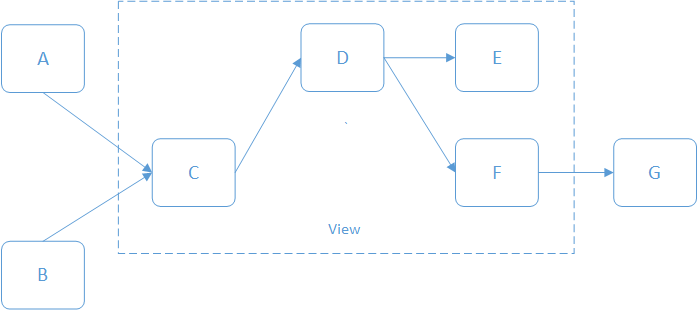

# FieldView

FieldView is a software solution for visualising the mapping of data between one system and another.

In even the most simple of integrated solutions you will find that data is continually mapped between one solution and another.  A good example of such a mapping is an API which presents data in one form and an application which consumes that data.  The consuming application is unlikely to have the same format as the incoming data and as such some mapping will occur.  When this mapping happens occurs over more than one layer it can become difficult to track this mappings.

One way flow, not an ER tool!

Many different ways to model the same data.

Find field interactions across multiple systems to help impact assess the size of a change.

# Destination

# Terminology

## Source

We need to consider data at the highest level.  It is not important which interfaces provide the data between the systems, it is all about distinct `sources` and `destinations`.

Don't try to model the technologies, you need to model the partitioned data on a per case basis.

Potential sources could be:
- Web form
- Interface message

If you have the **same system** in the model twice then you are doing it wrong.

## Destination

A location that a source is linked to via a `Map`.

## Diagram
A diagram contains many schemas and has an orthagonal layout with edge grouping.

## Schema
A [JSON Schema](https://json-schema.org/) which represents part of a data model in one of the systems you are trying to map.

The schema can represent either flat or hierarchical data.

## Field
Each schema contains a number of `Field` definitions.  The minimum information that can be defined for a `Field` is `name` and `type`.

## Map
A JSON document which uses JSON Pointers to map fields between the different schemas.

## View
A JSON document which defines which `Schema` to display.

# Concepts

## Ingestion
FieldView uses JSON schemas to represents each data source.

It is easy to generate JSON schemas using either pre-defined JSON data as a template or via an online converter to transform existing XSL//Flat to one.

Could we potentially use Machine Learning (ML) to improve this process so we can feed any type of file in and get a JSON schema out?

We ingesting existing data to build a schema we should populate the `examples` node of each Field with the values from the data to provide a more realistic payload examples.

## Transformation
TODO - We need a mechanism for describing the transformation process between a `source Field` and a `destination Field`

Ordered list of `transformations` which is defined in the map against a `source` and `destination` field.

**How much of this would overlap with a Rules Engine?**

```
"input1": {
    "source": {
        "$ref": "schemas/test/a.schema.json#/properties/code"
    },
    "destination": {
        "$ref": "schemas/test/c.schema.json#/properties/aid"
    },
    tranformations: [
        // FUNCTIONS ARE NO GOOD FOR DESCRIBING A TRANSFORMATION (THEY WOULD PROVE USEFUL IN FIELD FLOW THOUGH!)
        (source) => {
            // this transforms data
            return source.replaceAll(' ', '-');
        }

        // WHAT IF WE DON'T USE A FUNCTION FOR THE DESCRIPTION
        // THESE COULD BE RUN IN A SET OF FUNCTIONS IF NEED BE!
        // CHAINING METHODS
        "source.replaceAll(' ', '-')",
        "source.toLowerCase()",
        "source.substring(0, source.indexOf('-'))",
    ]
}
```

# Features

## Example payload
Once a schema has been loaded, FieldView can generate a payload which validates against the schema.

Initially the values for all the keys in the example payload will be `null`.  However it is possible using one of the following methods to customise the values put into the example payload.

1. Provide a `default` value in the JSON Schema field definition. This will be used in preference to all other methods (default)
    ```
    "code": {
        "type": "string",
        "description": "The code for the object",
        "default": "ABC-12345"
    }
    ```
2. Provide an `examples` array which contains one or more examples of the data which this field contains.  If more than one value is supplied in the array then one will be selected randomly.
    ```
    "code": {
        "type": "string",
        "description": "The code for the object",
        "examples": ["ABC-12345", "DEF-12345", "GHI-12345"]
    }
    ```
3. Use [faker.js](https://github.com/marak/Faker.js/) support to generate a value.

    Using the `faker` property of a JSON schema field defintion, you can configure `faker.js` using the following two properties:
    - `id` - The name of the [faker.js API method](http://marak.github.io/faker.js/) to run
    - `options` - An array of arguments to pass to the `faker` method as per the [API documentation](http://marak.github.io/faker.js/)

    **random.number**
    ```
    "faker": {
        "id": "random.number",
        "options": [
            {
            "min": 0,
            "max": 100,
            "precision": 1
            }
        ]
    }
    ```

    **helpers.replaceSymbols**
    ```
    "faker": {
        "id": "helpers.replaceSymbols",
        "options": ["CDC-###-???-01"]
    }
    ```

## Rooting

Allow JSON `root` to be defined in a `Schema` definition file.  This useful for discarding ancestors from the display path

Suppose we have the follow piece of JSON data:
```
{
    "data": {
        "result": {
            "field1": "val1"
        }
    }
}
```
Using the this Schema to describe the data:
```
{
    "$schema": "http://json-schema.org/draft-07/schema#",
    "type": "object",
    "root": "/properties/data/properties/result",
    "properties": {
        "data": {
            "type": "object",
            "properties": {
                "result": {
                    "type": "object",
                    "properties": {
                        "field1": {
                            "type": "string"
                        }
                    }
                }
            }
        }
    }
}
```
The label displayed in the Field would be `field1` instead of `data/result/field1`.

## Meta Data
Each field can contain optional meta-data to further enrich the information of the field.  Define meta-data in the `meta` section of a JSON schema using key/value pairs. For example:
```
{
    "$schema": "http://json-schema.org/draft-07/schema#",
    "type": "object",
    "properties": {
        "name": {
            "type": "string",
            "description": "The name of the object",
            "minLength": 3,
            "maxLength": 255,
            "meta": {
                "UI Field Label": "Name",
                "Help text": "The human readable identifier for this object"
            }
        }
    }
}
```

## Views



At present we will define the `View` using a JSON document but in the future expect to allow the user to visually select the Schema for inclusion in a `View` and to provide some kind of label for the `View`.  Future improvements would be to allow selection of Schema for the View by either/or/and:
- clicking the panel
- selecting from a multi-select list component e.g. list of checkboxes
- using a draggable area to capture fields to include

The user can have as many views as they like (selectable?).

Using a `View` you are able to display isolated sections of the overall `Map`.

Using a `View` you can define a default panel height and also the height of each panel individually.

# Backlog

The following tasks are considered in scope:

**No more work to do, just test the current implementation!**

# Defects

The following defects have been identified during testing:

**No known defects!**

# Future improvements

The following ideas should be considered as future enhancments:

1. Validate all `Schema`, `Map` and `View` files on load, using a JSON schema
2. Advanced search which allows you to search for more than one criteria and also add meta-data fields to the search on-demand
3. Auto-complete for the search field which allows you to quickly select just a single field
4. Pop-up menu on Panel to show information, allow actions, etc
5. Mini-map which allows dragging around the diagram
6. Manual ordering for the fields within a panel using DnD (currently only available via `Map` file definition)
7. Custom layout mode for the schema Panels using DnD to position
8. Vertical resizable panels by dragging edges (currently only available via `height` attribute of schema)
9. Pre-defined zoom levels
10. Show hierarchical fields as a tree so that you can fold whole sections up/down, including necessary arrow changes
11. Map analysis to find columns which will not fit between source and destination
12. Use ML to guess the data types from a payload
13. Design a way of *defining* and *visualing* any transformation between a source and destination field
14. Multipicity labels on the schema view between entities, either end of the connector.  Where would we define?
15. Add some visual grouping and/or labels that represent groups to allow easier identification of which system each schema resides within
16. Create `Diagram` file which defines a `Map` and also a list of `View` paths which should be selectable by user in drop-down located in the toolbar.
17. During ingestion of existing payload, populate the `examples` array of the `Schema`.
18. Use different colours for each non-related panel and match the colour of the arrows to the panel. See [Example](images/introduction2.png)

## Field Flow

The ability to simulate data going through the model.  Pass some data into the model at some point and get a value out from another point with all the transformation applied.

## Field Rules

Rules engine which maps rules to fields in the schemas.
Rules are defined in a seperate set of files to the schemas.